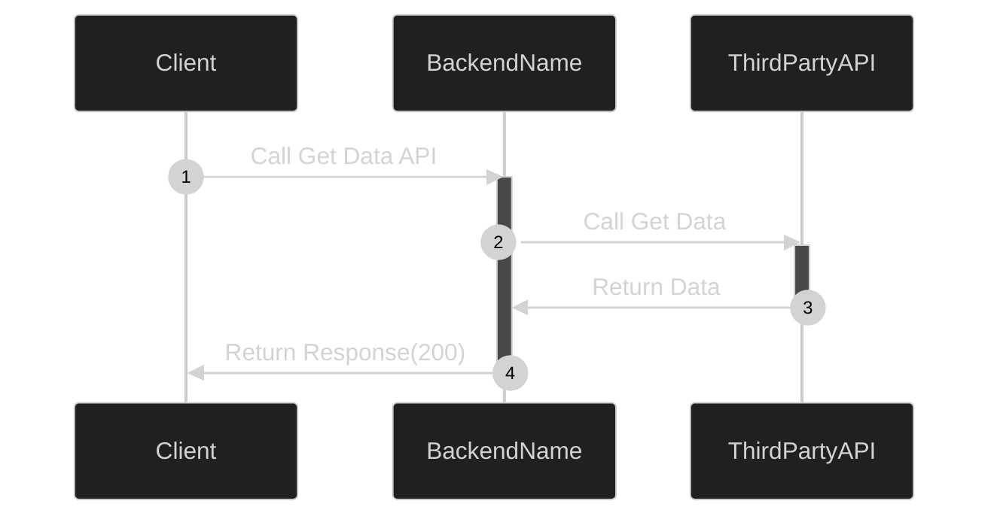

# Get Data
取得第三方平台資料

## Get Data API Workflow

```mermaid
sequenceDiagram
%%{init: {'securityLevel': 'loose', 'theme': 'dark'}}%%
    autonumber
    participant C as Client
    participant BN as BackendName
    participant TPA as ThirdPartyAPI

    C->>BN: Call Get Data API
    activate BN

    BN->>TPA: Call Get Data
    activate TPA
    TPA->>BN: Return Data
    deactivate TPA
    
    BN->>C: Return Response(200)
    deactivate BN
```